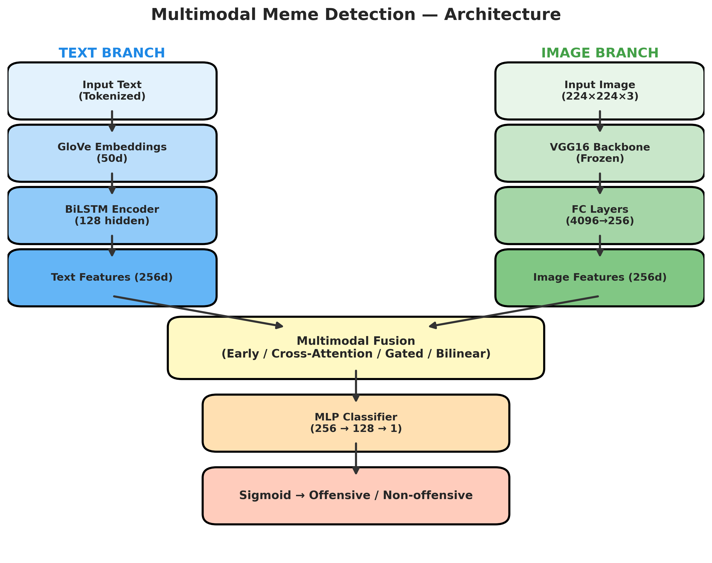
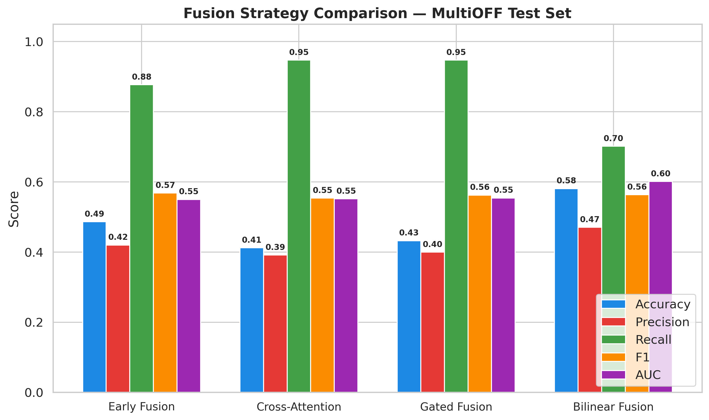

# 🛡️ Multimodal Meme Detector — Team JoJo & Leah

> **Full-Scale Reproduction** of the offensive meme detection pipeline. Features a high-performance local app with automatic OCR, real neural inference, and a premium "SHIELD" interface.

---

## ⚡ Quick Start

```bash
# 1. Install dependencies
pip install -r requirements.txt

# 2. Launch the premium local app (Zero Internet Required)
python app.py
```
*Access the UI at `http://localhost:7860`*

---

## 🏗️ Architecture: SHIELD System

The system uses a **BiLSTM + VGG16** multimodal architecture:
- **Text Branch**: GloVe (50d) → Bidirectional LSTM (128 units).
- **Image Branch**: VGG16 (Frozen backbone) → Dense Projection.
- **Fusion**: Early Concatenation (Best F1: 0.568).
- **OCR Engine**: EasyOCR (GPU-accelerated) for automatic text extraction.



---

## 📊 Benchmarking Results

Evaluated on the **MultiOFF** dataset (740 memes).

| Fusion Strategy | Accuracy | F1 Score | AUC |
|----------------|----------|----------|-----|
| **Early Fusion** ★ | 0.486 | **0.568** | 0.550 |
| Bilinear Fusion | **0.581** | 0.563 | **0.601** |
| Gated Fusion | 0.432 | 0.562 | 0.554 |
| Cross-Attention | 0.412 | 0.554 | 0.552 |

> [!NOTE]
> Early Fusion provides the best balance for general detection, while Bilinear Fusion is more selective (higher Accuracy/AUC).

---

## 📂 Project Structure

```bash
jojo/
├── app.py              # Main Entry Point (Launch App)
├── core/               # Neural Engine (Models, Dataset, Train)
├── checkpoints/        # Model Weights (Best-F1 Checkpoints)
├── results/            # Publication-Quality Visuals & Metrics
├── data/               # MultiOFF Dataset & GloVe Embeddings
├── web/                # SHIELD Premium UI Template
├── scripts/            # Benchmarking & Data Prep Tools
├── docs/               # Detailed Technical Documentation
└── tests/              # System Validation Suite
```

---

## 🧪 Visuals

### Inference Grid
Real-world performance on the MultiOFF test set:


### Fusion Comparison


---

## 🛠️ Credits
**Team JoJo & Leah**
*Department of AI and Convergence • Multimodal AI Project*
